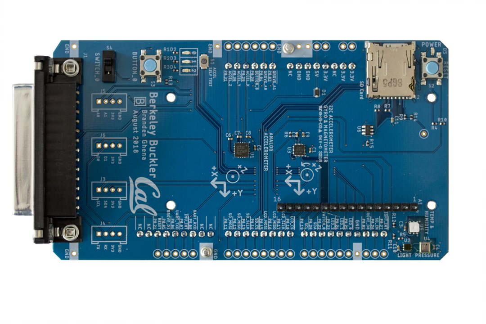

Berkeley Buckler
================

[](https://app.travis-ci.com/github/lab11/buckler)

A development board for teaching embedded systems.



### Getting Started

 1. Clone this repository and update the submodule

```
  $ git clone https://github.com/lab11/buckler.git --recursive
  $ git subomdule update --init --recursive
```

 2. Build an example application

```
  $ cd software/apps/blink/
  $ make
```

You should see results similar to

```
BUILD OPTIONS:
  Chip        nrf52832
  RAM         64 kB
  FLASH       512 kB
  SDK         15
  SoftDevice  s132 6.0.0
  Board       Buckler_revB

 DIR        _build
 CC main.c ...
 ... (many more CCs) ...
 LD _build/blink_sdk15_s132.elf
 HEX _build/blink_sdk15_s132.hex
 BIN _build/blink_sdk15_s132.hex
 SIZE _build/blink_sdk15_s132.elf
 text    data    bss     dec    hex   filename
 37672   2548   2624   42844   a75c   _build/blink_sdk15_s132.elf
```

 3. Load the example application (be sure to connect your Buckler board)

```
  $ make flash
```

The three LEDS (red, yellow, and blue) on Buckler should begin a blinking
sequence.


### Build Options

Several make directives exist for convenience of performing common operations.

 * **flash** - Upload code to the attached board over JTAG. Also builds code if
               necessary.
 * **rtt** - Open two additional terminals, one starting a JTAG connection and
             the other with an RTT terminal.
 * **gdb** - Open two additional terminals, one starting a GDB server and the
		     the other with a GDB session.
 * **debug** - Build application in unoptimized debug mode (with `-g` and `-O0`).
 * **flash_debug** - Upload debug version of code to the attached board over JTAG.
				     Also builds the debug version of code if necessary.
 * **erase** - Erase all code from the attached board over JTAG.
 * **flash_softdevice** - Upload the appropriate softdevice to the board over JTAG.
						  `make flash` automatically runs this command.
 * **clean** - Remove all built output.
 * **size** - Print size of built application text and data segments.
 * **lst** - Generate an assembly listing of the built code.


### Directory Structure

```
├── hardware
│   └── <Various hardware revisions>
│       ├── <PDF version of schematic and layout>
│       ├── <Eagle schematic and layout files>
│       └── <Zipped assembly files>
├── media
│   └── <Images used in repo>
└── software
    ├── apps
    │   └── <Various applications>
    │       ├── <Code for application>
    │       └── <Makefile for application>
    ├── boards
    │   └── <Board-specific headers and Makefiles>
    ├── libraries
    │   └── <Various libraries>
    ├── nrf5x-base
    │   └── <Submodule: build tools and files for nRF projects>
    └── tools
        └── <Tools for Travis-CI use>
```

### Project Repositories

If you are using Buckler for a project, we recommend you include it as a
submodule in your own repository. An example of how to do so can be found in:
[buckler-external-repo](https://github.com/brghena/buckler-external-repo)

### Software Requirements

In order to get code compiling and loading over JTAG, you'll need at least two tools.

**JLinkExe** should be installed from [here](https://www.segger.com/downloads/jlink).
You want to the "J-Link Software and Documentation Pack". There are various packages
available depending on operating system.


**arm-none-eabi-gcc** is the cross-compiler version of GCC for building embedded ARM code.

  MacOS:
  ```
  $ brew tap ARMmbed/homebrew-formulae && brew update && brew install arm-none-eabi-gcc
  ```

  Ubuntu:
  ```
  $ sudo add-apt-repository ppa:team-gcc-arm-embedded/ppa && sudo apt update && sudo apt install gcc-arm-embedded
  ```
